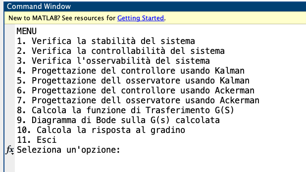
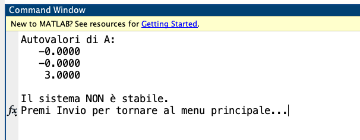

# 🚀 State-Space Control Toolbox
### An interactive MATLAB toolbox for state-space control system analysis and design

## 📌 Overview  
**State-Space Control Toolbox** is a MATLAB script designed for analyzing and designing **control systems in state-space representation**. It includes tools for **stability verification, controllability, and observability checks**, along with **controller and observer design using Kalman and Ackermann methods**. Additionally, it provides **transfer function computation, Bode diagram plotting, and step response analysis**.

## 🎯 Features  
- ✅ **Interactive input** for matrices \( A, B, C \)  
- ✅ **Stability verification** via eigenvalues analysis  
- ✅ **Controllability and observability analysis**  
- ✅ **Controller design** using **Kalman’s method**  
- ✅ **Observer design** using **Kalman’s method**  
- ✅ **Controller design** using **Ackermann’s method**  
- ✅ **Observer design** using **Ackermann’s method**  
- ✅ **Transfer function computation** \( G(s) \)  
- ✅ **Bode diagram plotting** for system analysis  
- ✅ **Step response computation** for dynamic behavior evaluation  

## 🔧 Installation & Usage  
1. Clone the repository:  
   ```bash
   git clone https://github.com/lcava000/state-space-control-toolbox.git
   ```
2. Open MATLAB and navigate to the repository folder.  
3. Run the script:  
   ```matlab
   run('script.m')
   ```
4. Follow the on-screen instructions to input system parameters and perform various operations.

## 📌 Screenshots  
**Main menu interface:**  
  

**Example of stability verification:**  
  

This script has been developed as a supplementary tool to enhance the understanding of the subject and provide a mathematical verification of the studied concepts. It is not intended to replace exercises or official course materials provided by the professors. Instead, it should serve solely as a supporting resource for students. Please note that this material may contain errors and should be used with discretion.

📍 **Università di Catania**  
🎓 **Corso di Automatica**  
👨‍🏫 **Prof. Paolo Pietro Arena & Prof. Giuseppe Sutera**  
📅 **Anno Accademico: 2024-2025**  

## 👨‍💻 Author  
**Lorenzo Cavallaro** (`lcava000`)  
📧 Contact: Lcava000@gmail.com

---

⭐ **If you find this project useful, consider giving it a star!**  
🔹 Feel free to contribute with improvements or suggestions! 🚀
